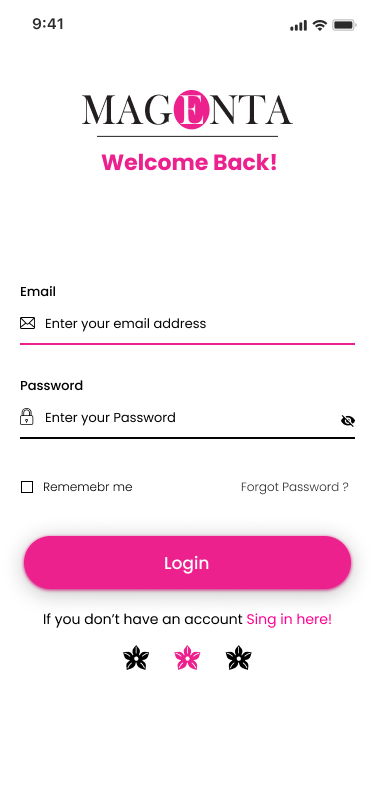
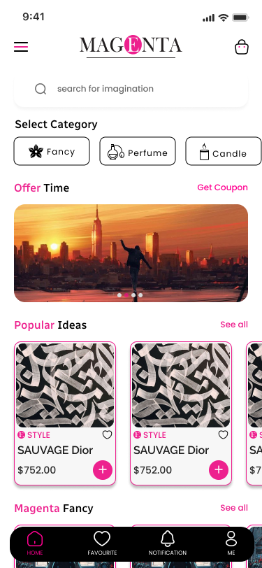
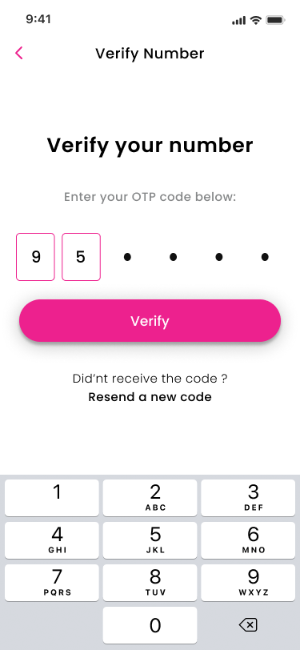
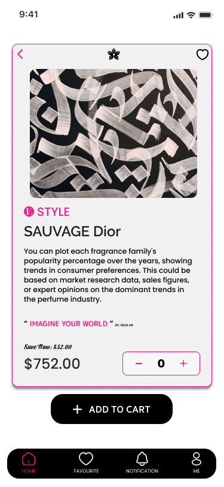

GitHub: [github.com/Abdo-ka/Magenta](https://github.com/Abdo-ka/Magenta)

### About

This was a project in 4th year in college, which I've built with my classmates.

The platform aims to help ease selling and Perfumes items by acting as a intermediary between users (sellers and buyers).

I've built the mobile application .

### Tech Stack

- **Mobile**: Flutter, Firebase, Notification Services,MVC pattern,CI/CD.

### User Application

- Users can See items for sell
- Comment, like on posted items and start a chat with the seller.
- Add To Cart and availability check it and for Status.
- Availability to add to favorite to get to it back later

#### User Gallery

p]:grid [&>p]:gap-1 [&>p]:md:grid-cols-2 [&_img]:m-0 [&_img]:object-cover [&_img]:h-[400px] [&_img]:min-h-[200px]">
     

